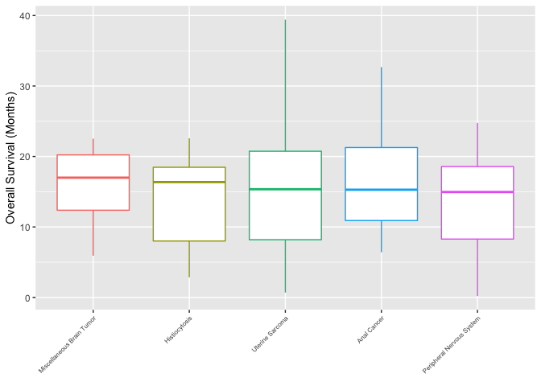
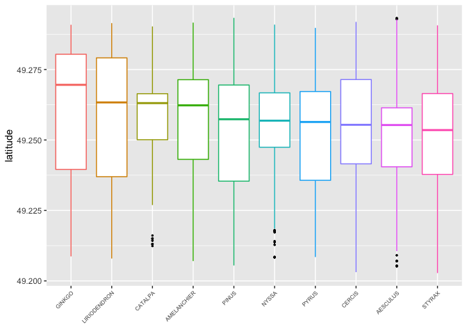
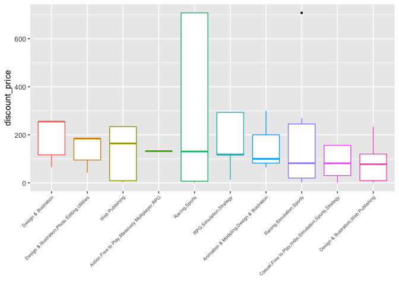

    library(tidyverse)
    library(datateachr)

# Function

We create a function that is able to plot a numerical variable across a
categorical variable. It has the added feature of ensuring a readable
plot will be obtained by filtering for 10 categories by median in either
ascending or descending order.

    boxplot_10 <- function(df, categorical, numerical, min_sample_size = 10, na.rm = TRUE, .desc = FALSE) {
      # calculate medians and filter by minimum sample size
      top_10 <- df %>%
        group_by({{ categorical }}) %>%
        summarize(median = median({{ numerical }}, na.rm = na.rm), count = n()) %>%
        filter(count > min_sample_size)

      # order categorical in ascending or descending order
      if (.desc == T) {
        top_10 <- top_10 %>%
          arrange(desc(median)) %>%
          head(10) %>%
          pull({{ categorical }})
      } else {
        top_10 <- top_10 %>%
          arrange(median) %>%
          head(10) %>%
          pull({{ categorical }})
      }

      # filter for variables to be plotted and set levels
      df_10 <- df %>%
        filter({{ categorical }} %in% top_10) %>%
        mutate(categorical = fct_reorder({{ categorical }}, {{ numerical }}, na.rm = na.rm, .desc = .desc))
      # ggplot automatically removes NA when plotting

      # ggplot visualization
      ggplot(df_10, aes(
        x = categorical,
        y = {{ numerical }},
        color = categorical
      )) +
        geom_boxplot(outlier.color = "black", outlier.size = 0.5) +
        theme(
          axis.text.x = element_text(size = 6, angle = 45, vjust = 1, hjust = 1),
          legend.position = "none"
        ) + xlab(element_blank())
    }

# Examples

**Example 1.** A clinical cancer dataset is used to plot overall
survival for different cancer types. We choose a minimum sample size of
5, and order the types in descending order of median overall survival.

    #load and preview the dataset
    msk <- read_tsv("https://raw.githubusercontent.com/stat545ubc-2021/mini-data-analysis-EL/main/data/msk_impact_2017_clinical_data.tsv")

    ## Rows: 10945 Columns: 26

    ## ── Column specification ────────────────────────────────────────────────────────
    ## Delimiter: "\t"
    ## chr (19): Study ID, Patient ID, Sample ID, Cancer Type, Cancer Type Detailed...
    ## dbl  (7): DNA Input, Fraction Genome Altered, Mutation Count, Overall Surviv...

    ## 
    ## ℹ Use `spec()` to retrieve the full column specification for this data.
    ## ℹ Specify the column types or set `show_col_types = FALSE` to quiet this message.

    head(msk)

    ## # A tibble: 6 × 26
    ##   `Study ID` `Patient ID` `Sample ID` `Cancer Type` `Cancer Type De… `DNA Input`
    ##   <chr>      <chr>        <chr>       <chr>         <chr>                  <dbl>
    ## 1 msk_impac… P-0000004    P-0000004-… Breast Cancer Breast Invasive…         250
    ## 2 msk_impac… P-0000015    P-0000015-… Breast Cancer Breast Invasive…         198
    ## 3 msk_impac… P-0000023    P-0000023-… Mesothelioma  Peritoneal Meso…         250
    ## 4 msk_impac… P-0000024    P-0000024-… Endometrial … Uterine Endomet…         250
    ## 5 msk_impac… P-0000025    P-0000025-… Endometrial … Uterine Serous …         250
    ## 6 msk_impac… P-0000025    P-0000025-… Endometrial … Uterine Serous …         250
    ## # … with 20 more variables: Fraction Genome Altered <dbl>,
    ## #   Matched Status <chr>, Metastatic Site <chr>, Mutation Count <dbl>,
    ## #   Oncotree Code <chr>, Overall Survival (Months) <dbl>,
    ## #   Overall Survival Status <chr>, Primary Tumor Site <chr>,
    ## #   Sample Class <chr>, Sample Collection Source <chr>,
    ## #   Number of Samples Per Patient <dbl>, Sample coverage <dbl>,
    ## #   Sample Type <chr>, Sex <chr>, Smoking History <chr>, …

    boxplot_10(msk, `Cancer Type`, `Overall Survival (Months)`, min_sample_size = 5, na.rm = T, .desc = T)

    ## Warning: Removed 399 rows containing non-finite values (stat_boxplot).

 **Example 2.** A
dataset on vancouver trees from the datateachr package is used to create
a plot of the tree genera with the greatest median altitude, as a
indicator of which trees tend to be located more north.

    boxplot_10(vancouver_trees, genus_name, latitude, .desc = T, min_sample_size =  100)

    ## Warning: Removed 1994 rows containing non-finite values (stat_boxplot).

**Example 3.** We use another dataset from datateachr, this time for
steam games, to visualize the discount for games of different genres.

    boxplot_10(steam_games, genre, discount_price, min_sample_size =  20, .desc = T)

    ## Warning: Removed 488 rows containing non-finite values (stat_boxplot).

