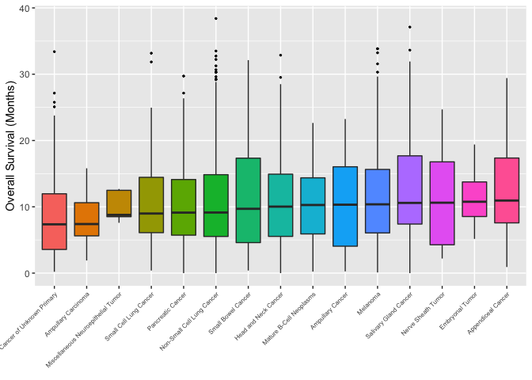

<!-- README.md is generated from README.Rmd. Please edit that file -->

# boxquickplot

<!-- badges: start -->
<!-- badges: end -->

The goal of boxquickplot is to provide users with a function to generate
a boxplot figure in a single line. The figure has the added features of
being organized in either ascending or descending order of the median of
the plotted numerical variable for any desired number of categories to
be included.

## Installation

You can install the development version of boxquickplot from
[GitHub](https://github.com/) with:

``` r
# install.packages("devtools")
devtools::install_github("stat545ubc-2021/functions-YFL-UBC/boxquickplot/")
#> Skipping install of 'boxquickplot' from a github remote, the SHA1 (820a1a0b) has not changed since last install.
#>   Use `force = TRUE` to force installation
```

## Example

This is a basic example which shows you a plot of a cancer dataset,
obtained from [cBioPortal](https://www.cbioportal.org), to show the 15
deadliest cancer types by overall survival.

``` r
library(boxquickplot)
library(readr)
## basic example code
msk <- read_tsv("https://raw.githubusercontent.com/stat545ubc-2021/mini-data-analysis-EL/main/data/msk_impact_2017_clinical_data.tsv")
#> Rows: 10945 Columns: 26
#> ── Column specification ────────────────────────────────────────────────────────
#> Delimiter: "\t"
#> chr (19): Study ID, Patient ID, Sample ID, Cancer Type, Cancer Type Detailed...
#> dbl  (7): DNA Input, Fraction Genome Altered, Mutation Count, Overall Surviv...
#> 
#> ℹ Use `spec()` to retrieve the full column specification for this data.
#> ℹ Specify the column types or set `show_col_types = FALSE` to quiet this message.
boxplot_10(msk, `Cancer Type`, `Overall Survival (Months)`, plot = 15, min_sample_size = 5, na.rm = T, .desc = F)
```


